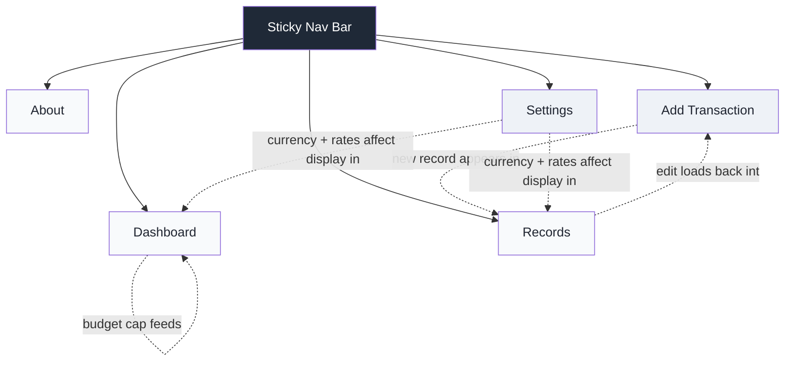
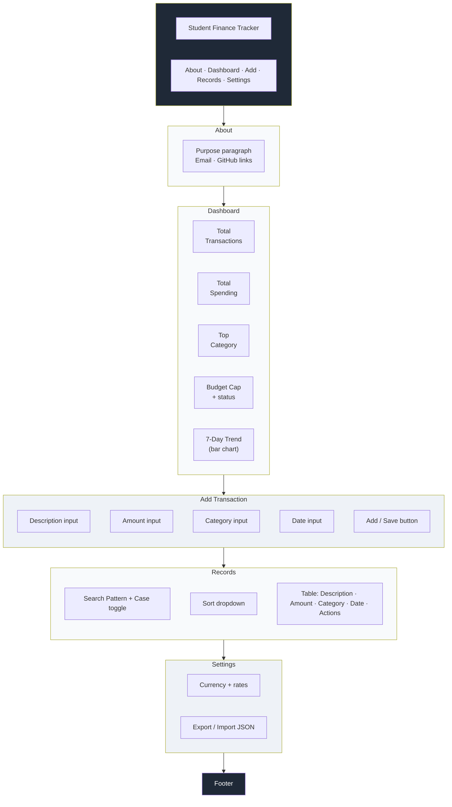
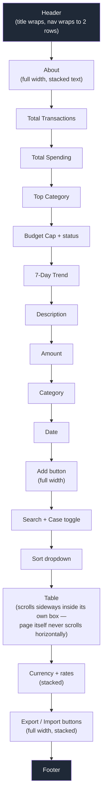

# Wireframes & Layout Plan

This document covers the structural plan for the Student Finance Tracker — page layout, section order, and how the layout adapts across breakpoints. Written as part of the M1 planning phase, before implementation.

> **Note on viewing:** the diagrams below use [Mermaid](https://mermaid.js.org/), which GitHub renders natively as real diagrams directly in this file — no extra setup needed, no images to keep track of.

---

## 1. Site Map

How the five sections relate to each other. All five live on a single scrollable page, linked by anchor navigation — not separate routed pages.

**Why one page, not five:** all sections share the same `transactions` array in memory and the same `localStorage` key. Splitting into separate HTML pages would mean re-reading from storage on every navigation for no real benefit, and would break the single skip-link / single keyboard tab order that makes the page easy to navigate by keyboard.

---

## 2. Desktop & Tablet Layout (768px and up)

**Key layout decisions at this size:**
- Dashboard cards sit in a row (2 columns at 768px, 3 columns at 1024px+)
- The form is centered with a max-width, rather than stretching edge-to-edge — keeps line length comfortable for reading/filling fields
- The records table renders as an actual `<table>`, not cards, since there's enough horizontal room

---

## 3. Mobile Layout (~360–430px)

**Key layout decisions at this size:**
- Dashboard cards stack to a single column — no information is hidden, just reflowed vertically
- All buttons and inputs go full-width, so touch targets stay large and easy to tap
- The table is the one element that doesn't reflow — instead of becoming illegible, it scrolls horizontally *within its own bounded box*, so the rest of the page layout stays stable

---

## 4. Responsive Breakpoint Summary

| Breakpoint | Width | Nav | Dashboard Cards | Form | Table |
|---|---|---|---|---|---|
| Mobile (base styles) | ~360–430px | Wraps to 2 rows | 1 column | Full-width inputs/buttons | Scrolls horizontally in its own box |
| Tablet | 768px+ | Single row | 2 columns | Centered, max-width 600px | Fits fully on screen |
| Desktop | 1024px+ | Single row | 3 columns | Centered, max-width 600px | Fits fully on screen |

---

## 5. Component Notes

| Component | Behavior |
|---|---|
| **Sticky header** | Stays pinned to the top while scrolling, so navigation is always one tap/click away |
| **Active nav link** | Highlights based on which section is currently scrolled into view, tracked via scroll position in JS |
| **Skip link** | First focusable element on the page — jumps keyboard users straight to `<main>`, bypassing the header/nav |
| **Budget status** | Color-coded (green/red) and read aloud differently depending on state — `aria-live="polite"` when under budget, `aria-live="assertive"` when over |
| **Form ↔ Records relationship** | The Add Transaction form is reused for editing — clicking "Edit" on a record scrolls to the form, pre-fills it, and swaps the submit button to "Save Changes" |

---

*This wireframe was created during the planning phase (M1) and reflects the structure the app was built against. Minor layout decisions (exact spacing, color tints) were refined during the polish phase (M7), but the section order and core structure shown here did not change.*
